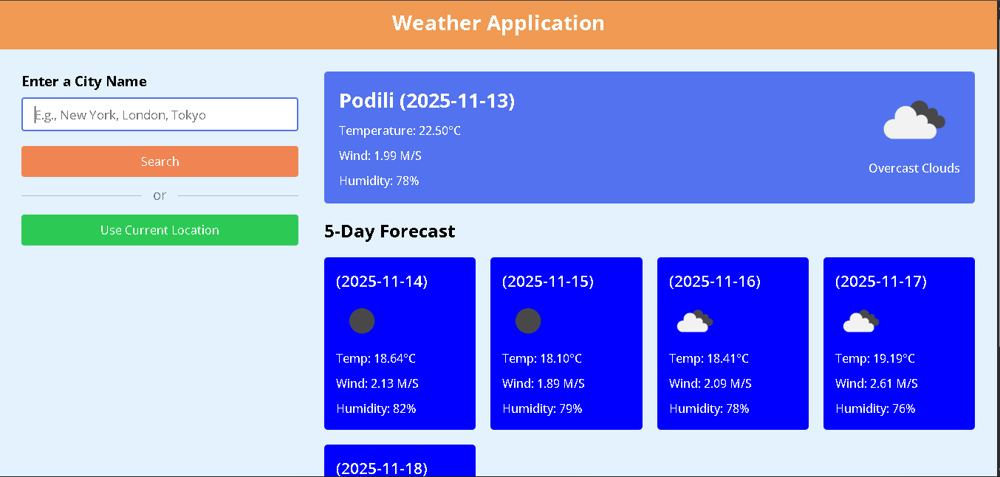

## 🌦️ Weather Forecasting Web App

A responsive Weather Forecasting web application built using **HTML**, **CSS**, and **JavaScript** that fetches live data from the **OpenWeatherMap API**.

### 📸 Project Preview

### 💡 Features
- Real-time weather updates  
- 5-day forecast display  
- Search by city name or use current location  
- Responsive and user-friendly interface  

### 🧰 Technologies Used
- HTML5  
- CSS3  
- JavaScript (Fetch API)  
- OpenWeatherMap API  
